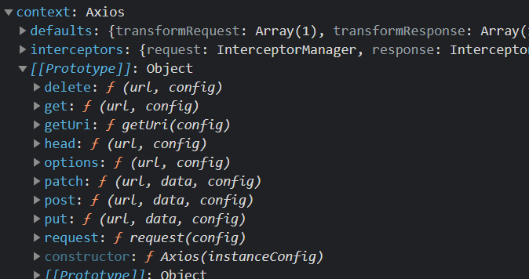
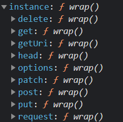
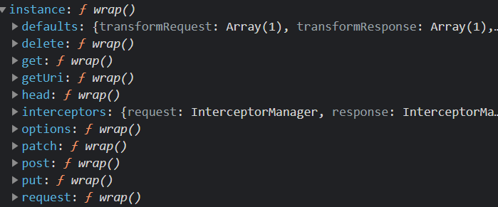
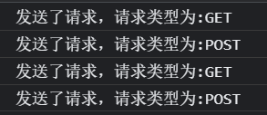

# axios源码学习（1）

## 1. 目录结构

> ├── /dist/                     # 项目打包目录
> ├── /lib/                      # 项目源码目录
> │ ├── /cancel/                # 定义取消功能
> │ ├── /core/                   # 一些核心功能
> │ │ ├── Axios.js                             # axios的构造函数
> │ │ ├── dispatchRequest.js           # 决定使用某个适配器(http xhr)方法发送请求
> │ │ ├── InterceptorManager.js      # 拦截器构造函数
> │ │ └── settle.js                  # 根据http响应状态，改变Promise的状态(成功或者失败)
> │ ├── /helpers/               # 一些辅助功能方法
> │ ├── /adapters/             # 定义请求的适配器 xhr、http
> │ │ ├── http.js                    # 实现http适配器
> │ │ └── xhr.js                     # 实现xhr适配器
> │ ├── axios.js                 # 真正的入口文件，从这里开始执行
> │ ├── defaults.js             # 默认配置 
> │ └── utils.js                   # 一些公用方法
> ├── package.json         # 配置信息
> ├── index.d.ts               # 配置TypeScript的声明文件
> └── index.js                  # 整个包的入口文件

## 2.axios创建过程

首先我们从入口文件开始看，先看axios的整体创建过程

### 整体创建过程

```js
// /lib/axios.js
function createInstance(defaultConfig) {
  // 创建一个Axios实例
  var context = new Axios(defaultConfig);
   
  // 这样instance就指向了request方法，且上下文指向context，这里的instance是个方法，所以可以直接以 instance({}) 方式调用 
  var instance = bind(Axios.prototype.request, context);

  // 把Axios.prototype上的方法全都扩展到instance对象上，现在instance就有了get、post、put等方法
  // 并指定上下文为context，这样执行Axios原型链上的方法时，this会指向context
  utils.extend(instance, Axios.prototype, context);

  // 把context对象上的自身属性和方法扩展到instance上
  // 这样，instance 就有了defaults、interceptors属性。（这两个属性后面介绍）
  utils.extend(instance, context);

  return instance;
}

// 接收默认配置项作为参数，创建一个Axios实例，最终会被作为对象导出
var axios = createInstance(defaults);
```

上面这段的`createInstance`其实想要的做的功能很简单，就是返回一个Axios实例，这个就是axios的一大特点，该实例既可以用作函数直接执行，该函数就是`Axios.prototype.request()`这个函数，直接发起请求。

同时这个实例也可以当作一个对象使用，它有`Axios.prototype`上面的所有属性，比如`get() post()`等，最终可以直接通过axios.get()发起请求。

首先是`var context = new Axios(defaultConfig);`通过这句话，就差不多能理解如何创建axios的了。

### Axios.js

```js
// /lib/core/Axios.js
function Axios(instanceConfig) {
   // 实例的默认配置，由创建实例的时候传入
  this.defaults = instanceConfig; 
  // 拦截器，请求拦截器和响应拦截器
  this.interceptors = {
    request: new InterceptorManager(),
    response: new InterceptorManager()
  };
}
//是构造函数的核心方法，后面各种get，post等都是通过该方法执行的
Axios.prototype.request = function request(config){
     // ... 里面就是通过config来发起不同的请求
}

utils.forEach(['delete', 'get', 'head', 'options'], function forEachMethodNoData(method) {
 // 给原型上添加delete get等方法，用于后面axios.get()使用
  Axios.prototype[method] = function(url, config) {
    return this.request(mergeConfig(config || {}, {
      method: method,
      url: url,
      data: (config || {}).data
    }));
  };
});

utils.forEach(['post', 'put', 'patch'], function forEachMethodWithData(method) {
  	// ...同上
});
```

下面是现在`context`里面的内容



这个时候的`context`只是一个对象，还不能直接执行，但是可以通过`context.get()`发起请求。这时执行`bind()`函数，将`request()`方法绑定到`instance`，并指向`context`，现在能直接通过`instance()`发起请求。

然后再通过`utils.extend(instance, Axios.prototype, context)`这句话，将`Axios.prototype`上面的所有方法都挂载到`instance`上，这时候就能真正的通过`instance.get()`发起请求了。

这个时候的`instance`，此时已经有了各种方法，不是单纯的函数了。



最后通过`utils.extend(instance, context)`，将`defaults、interceptors`属性挂载到`instance`上，最后向外导出。

最后向外导出的`instance`就长这样



这里很明显就能看出，`instance`它本身就是个函数，可以直接执行，同时它也是个对象，可以通过`.get()`的方法执行。就是axios实例的既可以用作对象调用方法，本身自己也可以当做函数发送请求（因为它自己是request函数）的原因。

## 3.模拟axios创建

第二步已经大概解释了axios的创建过程，这么一长篇下来可能已经晕了，下面来模拟一次，更清晰的理解。

```js
//模拟axios的创建过程

// 构造函数
function Axios(config){
    //初始化
    this.defaults = config;
    this.intercepters = { //拦截器
        request: {}, //请求拦截
        response: {} //相应拦截
    }
}
// 原型相关方法
Axios.prototype.request = function(config) {
    console.log(`发送了请求，请求类型为:${config.method}`);
}
Axios.prototype.get = function(config){
    return this.request({method: 'GET'})
}
Axios.prototype.post = function(config){
    return this.request({method: 'POST'})
}

//声明函数
function createInstance(config){
    // 实例一个对象
    // 此时可以context.get() context.post() 不能context()
    let context = new Axios(config); //是个对象
    // 创建请求函数，该方法和上面那种一致，它那个是自己封装过
    // 此时instance是一个函数，可以直接instance({}) 不能instance.get() .post()
    let instance = Axios.prototype.request.bind(context); //是个函数
    //将Axios.prototype上面的方法添加到instance中
    Object.keys(Axios.prototype).forEach(key => {
        //这里的key就是request get post
        //这里加个bind()是为了将request get post的this全都指向到当前这个context
        instance[key] = Axios.prototype[key].bind(context); 
    })
    
    // 为instance函数对象添加属性 defaults 和 intercepters
     Object.keys(context).forEach(key => {
        //这里的key就是defaults intercepters
        instance[key] = context[key]; 
    })
    return instance;
}
//接收创建的对象
let axios = createInstance();
// 测试
axios({method: 'GET'}); //和requset()方法一样的
axios({method: 'POST'});
axios.get();
axios.post();
```

到这时候就模拟实现了一个简单的axios，并且有get请求和post请求，下面是模拟结果。



## 最后

这次说了axios的创建过程，同时模拟了简单的axios使用，就是如何同时当作函数和对象来使用，下篇文章将说一下