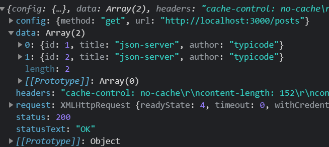

# axios源码学习（2）

> 在上篇文章说了`Axios`的创建过程，说了如何同时当作函数和对象使用，我们也知道了无论以那种方式发起请求，最终都是以`Axios.prototype.request()`该方法发起的请求，这次就来说一下`request()`方法具体是如何发起请求的。

## Request

要搞懂如何发起请求，那么首先要发起一个请求吧，这里我选择了`json-server`来模拟API，具体使用方法很简单，可以参照官方文档 [json-server官网](https://github.com/typicode/json-server)。

```js
// test.html
axios({
    method:'get',
    url:'http://localhost:3000/posts'
}).then(res => console.log(res))
```

下面就来具体分析一下`Axios.prototype.request()`这个方法

```js
// axios/lib/core/Axios.js line 27
Axios.prototype.request = function request(config) {
   //判断传入的config是是什么类型，允许传入(url,{})这种形式
  if (typeof config === 'string') {
    config = arguments[1] || {};
    config.url = arguments[0];
  } else {
    config = config || {};
  }
  // 对传入的config作处理，添加默认配置，同时添加对应的adapter
  config = mergeConfig(this.defaults, config);

  //设置请求方式，如果没传的话就是get
  if (config.method) {
    config.method = config.method.toLowerCase();
  } else if (this.defaults.method) {
    config.method = this.defaults.method.toLowerCase();
  } else {
    config.method = 'get';
  }

  // 这里dispatchRequest就是指定哪种adapter，也是就/lib/adapters下面的http.js或者xhr.js
  // 浏览器环境都是xhr。undefined是占位处理，后面拦截器相关会用到
  var chain = [dispatchRequest, undefined];
  // 这里的promise必定是一个成功Promise
  var promise = Promise.resolve(config);

  // ...拦截器相关代码，省略
    
  while (chain.length) {
    // 因为当前promise是成功状态，所以一定会执行第一个回调函数，也就是dispatchRequest
    // 然后会根据dispatchRequest的状态改变当前promise的状态
    // 如果dispatchRequest返回成功，那么最终用户接收到的结果也是成功的
    promise = promise.then(chain.shift(), chain.shift());
  }
  return promise;
};
```

上面的代码可以看出，`request`函数其实很简单，首先对传入的`config`进行处理，然后处理请求方式，最后就是根据`dispatchRequest`方法返回的结果，给用户返回请求结果。下面来说一下`dispatchRequest`方法。

## dispatchRequest

```js
// axios/lib/core/dispatchRequest.js line 23
module.exports = function dispatchRequest(config) {
   // 判断是否取了消发送请求
  throwIfCancellationRequested(config);
   //确保headers存在
  config.headers = config.headers || {};

   // 转换请求体，data。清理headers信息
   // ...
	
  //清理headers上的其他方法配置
  utils.forEach(
    ['delete', 'get', 'head', 'post', 'put', 'patch', 'common'],
    function cleanHeaderConfig(method) {
      delete config.headers[method];
    }
  );
  //获取对应适配器，浏览器环境都是xhr，这里也以xhr为例。
  var adapter = config.adapter || defaults.adapter;
	
  //调用对应的adapter函数，返回一个promise，然后根据promise的状态调用不同的回调函数，最终返回不同的结果。
  return adapter(config).then(function onAdapterResolution(response) {
  	//...请求成功，处理结果并返回
    return response;
  }, function onAdapterRejection(reason) {
	// ...错误处理
    return Promise.reject(reason);
  });
};
```

通过上面`dispatchRequest`方法可以看出，就是根据config里面对应的`adapter`，然后再调用`/lib/adapters`下面的`xhr.js` 或者`http.js`，发起对应的请求。浏览器环境这里都是发起`XMLHttpRequest`请求，具体请求过程这里不做介绍，后面模拟请求可以简单介绍下，具体可以参考`Ajax`教程。

最后用户就可以直接通过.then(res => {})的方法得到结果了。

最后还是写一个简单的模拟发送请求的过程。

```js
// 1.构造函数
function Axios(config){
    this.config = config;
}
// 发请求
Axios.prototype.request = function(config){
    // 创建promise对象
    const promise = Promise.resolve(config); //这个promise一定是成功的
    const chains = [dispatchRequest, undefined];//undefined占位
    //调用then方法指定回调
    //因为当前promise是成功的，所以一定会执行chains[0]这个回调，也就是dispatchRequest()
    const result = promise.then(chains[0],chains[1]);//result也是一个promise
    return result;
}

// 2. 调用对应的适配器发送请求，浏览器环境就是xhr这个适配器
function dispatchRequest(config){
    // 这里返回结果也一定是个promise对象
    return xhrAdapter(config).then(
        res => { //如果ajax请求成功，就返回成功的promise
            return res;
        },
        err => { //如果ajax请求失败，就返回一个失败的promise
            throw err;
        }
    )
}

// 3. adapter适配器
function xhrAdapter(config){
    return new Promise((resolve, reject) => {
        // 发送AJAX请求
        const xhr = new XMLHttpRequest();
        xhr.open(config.method,config.url);//初始化
        xhr.send();//发送
        //绑定事件
        xhr.onreadystatechange = function(){
            if(xhr.readyState === 4){
                //判断成功的条件
                if(xhr.status >= 200 && xhr.status <= 300){
                    //这里我们也可以自己封装返回的结果，
                    resolve({
                        config,
                        data: JSON.parse(xhr.response),
                        headers: xhr.getAllResponseHeaders(),
                        request: xhr,
                        status: xhr.status,
                        statusText: xhr.statusText
                    });//成功的状态
                }else{ //失败暂时不做处理
                    reject(new Error('请求失败，状态码为：' + xhr.status))
                }
            }
        }
    })
}
// 4.创建axios函数
const axios = Axios.prototype.request.bind(null);
axios({
    method:'get',
    url:'http://localhost:3000/posts'
}).then(res => console.log(res))
```

下面是这个demo的执行结果，可以看到已经实现的`Axios`的基本功能。



## 最后

这次我们讲了`request()`方法的具体实现过程，也体现的`Axios`的精髓，就是`Promise`和`Ajax`的结合使用，所以一定需要对`Promise`有基本了解，才能更好的理解。下篇文章将说一下拦截器功能。最后以一张流程图结尾吧。

