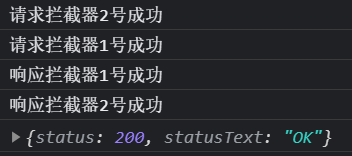

# axios源码学习（3）

> 上文说了`request()`方法的具体实现，这次来说下拦截器的实现。拦截器的设计极为巧妙，同时需要对`Promise`有一定掌握才能更好的理解。

## Interceptor

拦截器分为请求拦截器和响应拦截器，顾名思义，请求拦截器是在发起请求之前做点什么，而响应拦截器就是在发起请求之后，返回结果之前做点什么，具体是怎么实现的呢？其实很简单，就是一个数组，通过`shift,unshift,push`三个方法来实现的，下面将详细说下。

首先来看下拦截器的使用

```js
//设置请求拦截器
axios.interceptors.request.use(
    function fnReq1(config) {
        console.log('请求拦截器1号成功');
        return config
    },err => {}
)
axios.interceptors.request.use(
    function fnReq2(config) {
        console.log('请求拦截器2号成功');
        return config
    },err => {}
)

//响应拦截器
axios.interceptors.response.use(
    function fnRes1(config) {
        console.log('响应拦截器1号成功');
        return config
    },err => {}
)
axios.interceptors.response.use(
   function fnRes2(config) {
        console.log('响应拦截器2号成功');
        return config
    },err => {}
)
axios({
    method:'get',
    url:'http://localhost:3000/posts'
}).then(res => console.log(res))

```

我们这里设置了两个请求拦截器，两个响应拦截器，猜猜执行顺序会是什么？顺序是这样的


可以看出，先执行了请求拦截器2号，然后1号，然后执行响应拦截器。下面来看下源码，就知道为什么是这样的了。

## 解析

首先我们看`Axios`构造函数里面

```js
// axios/lib/core/Axios.js line 14
function Axios(instanceConfig) {
  this.defaults = instanceConfig;
   //注意这里
  this.interceptors = {
    request: new InterceptorManager(),
    response: new InterceptorManager()
  };
}
```

可以看到，在初始化一个实例对象时，新建了一个`interceptors`对象，其中存放一个`request`和`response`，这两个就是请求拦截器和响应拦截器，然后分别`new InterceptorManager() `，这里面其实很简单。

```js
// axios/lib/core/InterceptorManager.js line 5
function InterceptorManager() {
  this.handlers = [];
}
//这里重点，因为有两个拦截器，执行了两次use()，所以两次use()后handlers长这样：
//[{fnReq1,err},{fnReq2,err}]
InterceptorManager.prototype.use = function use(fulfilled, rejected) {
   // 存放一组回调函数，也就是axios.interceptors.request.use(fn, fn)传入的两个回调函数，
  this.handlers.push({
    fulfilled: fulfilled,
    rejected: rejected
  });
  return this.handlers.length - 1;
}
```

可以看出，`new InterceptorManager()`其实就是新建了一个数组，然后看下面的`use`方法，将一组回调函数暂存到`handlers`数组中，记住这里，后面要用到。

到这里再捋一下，已经知道了`request`和`response`其实就是两个数组，并且该数组有`use`方法，可以暂存一组回调函数。下面还是看`request`方法

```js
// axios/lib/core/Axios.js line 27
Axios.prototype.request = function request(config) {
  //...省略，设置config和method

  var chain = [dispatchRequest, undefined];
  var promise = Promise.resolve(config);

   //这里是重点，forEach实际是对handlers的遍历，这个forEach是重写过的。
   //记住此时request长这样：[{fnReq1,err},{fnReq2,err}]
   //循环将每一组回调都放入chain的最前面，所以会先放入fnReq1,err,然后放入fnReq2,err
  this.interceptors.request.forEach(function unshiftRequestInterceptors(interceptor) {
    chain.unshift(interceptor.fulfilled, interceptor.rejected);
  });
  //最后遍历完毕后，chain长这样：[fnReq2,err,fnReq1,err,dispatchRequest, undefined]
  //看到这里就应该明白为什么是拦截器2先执行了吧

  //同理，遍历响应拦截器，不过注意此时是push，也就是放在chain最后面
  this.interceptors.response.forEach(function pushResponseInterceptors(interceptor) {
    chain.push(interceptor.fulfilled, interceptor.rejected);
  });
    //最后遍历完毕后，chain长这样：
    // [fnReq2,err,fnReq1,err,dispatchRequest,undefined,fnRes1,err,fnRes2,err]
    
  //最后遍历chain，执行shift方法，每次都取出一组方法，所以执行顺序就很明显了。
  while (chain.length) {
    promise = promise.then(chain.shift(), chain.shift());
  }

  return promise;
};
```

根据上面这段代码，也解释了为什么`chain`数组一开始要用一个`undefined`来占位了，因为每次都是执行一组回调，所以`undefined`就相当于一个失败的回调了。重点就是**unshift**这个方法，将请求拦截器放在了数组前面，也就是请求前面来执行了。

由于`promise`的链式调用特性，每次`then`成功后，下一次都会执行第一个回调，所以相当于`chain`是跳一个挨着执行的。如果`chain`为空，那么表示所有的拦截器都执行完毕了，再将此时的`promise`返回给用户，就能得到最终的结果了。

下面还是以一段模拟代码来结束本文，模拟代码都是可以直接运行的，可以复制到本地自己试试。

```js
 // 1.构造函数
function Axios(config) {
    this.config = config;
    this.interceptors = {
        request: new InterceptorManager(),
        response: new InterceptorManager()
    };
}
Axios.prototype.request = function (config) {
    let promise = Promise.resolve(config);
    const chains = [dispatchRequest, undefined];
    //这里直接遍历handlers
    this.interceptors.request.handlers.forEach(item => chains.unshift(item.fulfilled, item.rejected));
    this.interceptors.response.handlers.forEach(item => chains.push(item.fulfilled, item.rejected));
    while(chains.length){
        promise = promise.then(chains.shift(), chains.shift());
    }
    return promise;
}

// 发送请求
function dispatchRequest(){
    // 直接返回一个成功的promise对象，后面的xhr就不写了
    return new Promise((resolve, reject) => {
        resolve({
            status: 200,
            statusText: "OK"
        })
    })
}
function InterceptorManager() {
    this.handlers = [];
}
InterceptorManager.prototype.use = function (fulfilled, rejected) {
    this.handlers.push({
        fulfilled,
        rejected
    })
}

// 创建实例
const context = new Axios({});
// .创建axios函数
const axios = Axios.prototype.request.bind(context);
//将config interceptors添加到axios函数上
Object.keys(context).forEach(key => {
    axios[key] = context[key];
})

//设置请求拦截器
axios.interceptors.request.use(
    function (config) {
        console.log('请求拦截器1号成功');
        return config
    },
    function (err) {
        console.log('请求拦截器1号失败');
        return Promise.reject(err);
    }
)
axios.interceptors.request.use(
    function (config) {
        console.log('请求拦截器2号成功');
        return config
    },
    function (err) {
        console.log('请求拦截器2号失败');
        return Promise.reject(err);
    }
)

//响应拦截器
axios.interceptors.response.use(
    function (config) {
        console.log('响应拦截器1号成功');
        return config //注意这里一定要返回config
    },
    function (err) {
        console.log('响应拦截器1号失败');
        return Promise.reject(err);
    }
)
axios.interceptors.response.use(
    function (config) {
        console.log('响应拦截器2号成功');
        return config
    },
    function (err) {
        console.log('响应拦截器2号失败');
        return Promise.reject(err);
    }
)

axios({
    method:'get',
    url:'http://localhost:3000/posts'
        }).then(res => console.log(res))
```

看到结果和原生的`Axios`完全一致，只是`xhr`那里没有真正的发送请求，而是直接返回了一个成功的`promise`。



## 最后

本次拦截器的学习，对`promise`和对数组的理解，都能得到提升。可能代码量看起来有点多，但是最重要的是`chain`数组的思想，搞懂这里就能理解了，这里也是拦截器的精髓所在。

下篇文章将说一下`Axios`是如何取消发送请求的。