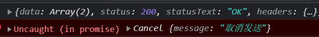
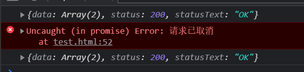

# axios源码学习（4）

> 在前面的文章我们说了关于`Axios`的构造，发送请求的过程，以及`Axios`关于拦截器的实现，这次来说下最后一部分，也就是关于如何取消发送。

## cancel

在这之前我们需要将`json-server`设置一个延时，不然还没取消，就已经发送完成了，设置延时就关闭`json-server`，然后重新执行下面这句话`json-server --delay 1000 db.json`，我们设置一个1s的延时，然后在1s内就可以取消发送了。

先来看一段示例代码，了解取消发送是如何使用的。

```html
<body>
    <button class="send">发送</button>
    <button class="cancel">取消</button>
    <script>
        let cancel = null;
        function send(){
            const cancelToken = new axios.CancelToken(c => {
                cancel = c;
            });
            axios({
                method:'get',
                url:'http://localhost:3000/posts',
                cancelToken
            }).then(res => console.log(res));
        }
        function cancelSend(){
            cancel('取消发送');
            cancel = null;
        }
    </script>
</body>
```

上面这段代码执行结果是这样的，我第一次发送成功了，第二次点击了取消发送，可以看到取消了发送，没有获取到结果。可以看到`cancel()`是在`new axios.CancelToken`时，传给我们的一个`c`函数，运行这个函数就可以取消了，那么是怎么做到的呢，接下来看源码吧。



## 分析

先看`axios.js`这个文件，我们可以看到，是在`createInstance`阶段，将`CancelToken`它挂载到`axios`上的。

```js
//axios.js
axios.Cancel = require('./cancel/Cancel');
axios.CancelToken = require('./cancel/CancelToken');
axios.isCancel = require('./cancel/isCancel');
```

然后进入`/lib/cancel/CancelToken.js`下面，

```js
///lib/cancel/CancelToken.js
function CancelToken(executor) {
  if (typeof executor !== 'function') {
    throw new TypeError('executor must be a function.');
  }
 //这里是重点，声明呢一个resolvePromise变量接收resolve
 //所以可知，直接运行resolvePromise这个函数的话，就可以改变this.promise的状态为成功。
  var resolvePromise;
  this.promise = new Promise(function promiseExecutor(resolve) {
    resolvePromise = resolve;
  });

  var token = this;
  //然后这里也是重点，用户new的时候是这样new的，所以executor就是c => cancel = c这个函数
  // const cancelToken = new axios.CancelToken(c => cancel = c);
  //然后executor里面再次声明一个函数，用户执行resolvePromise，也就是改变this.promise的状态
  //所以说：我们这个c就是下面这个cancel(message)函数，所以执行c()的时候也就改变了状态。
  executor(function cancel(message) {
    if (token.reason) {
      return;
    }
      
    token.reason = new Cancel(message);
    resolvePromise(token.reason);
  });
}
```

`const cancelToken = new axios.CancelToken(c => cancel = c)`，这个cancel是我们自己的一个变量，他接收一个传回来的`c`，而通过上面代码可以看出，这个c就是`CancelToken.js`里面`executor()`里面的函数，所以当执行我们自己的`cancel`时，也就改变了`this.promise`的状态了，记住这里很重要。

然后`new Cancel(message)`就是接收一个用户传入的消息，这里可以自行查看，下面我们再到`xhr.js`里面看

```js
// /lib/adapters/xhr.js
function xhrAdapter(config){
    // 前面都省略 ...
    //line 158
    // 判断config是否有cancelToken这个参数，这个参数就是我们new出来的cancelToken
    if (config.cancelToken) {
      // 看这个promise，如果这个promise成功了，就会执行里面的回调函数
      // 然后执行request.abort() 请求就取消了，这里是取消请求的最核心代码
      config.cancelToken.promise.then(function onCanceled(cancel) {
        if (!request) {
          return;
        }
          // 取消请求
        request.abort();
        reject(cancel);
        request = null;
      });
    }
}
```

关于请求取消功能的核心代码，只有10行，但是实现的很巧妙。

首先这个`config`是我们传入的`config`，还记得传入的时候我们`new CancelToken()`了吗，这里的`cancelToken`正是我们`new`的，然后它里面有一个`promise`属性，只要`cancelToken.promise`的状态成功了，就会取消请求，然后`reject`，返回用户传入的消息，那么什么时候成功呢？就是执行我们自己那个变量`cancel`的时候，也就是点击的时候。

## 模拟

还是来一段模拟吧

```html
<body>
    <button class="send" onclick="send()">发送</button>
    <button class="cancel" onclick="cancelSend()">取消</button>
    <script>
        // 前面这些都是之前说过的，核心就在xhrAdapter里面
        function Axios(config) {
            this.config = config;
        }
        Axios.prototype.request = function (config) {
            let promise = Promise.resolve(config);
            const chains = [dispatchRequest, undefined];
            while (chains.length) {
                promise = promise.then(chains.shift(), chains.shift());
            }
            return promise;
        }
        function dispatchRequest(config) {
            return xhrAdapter(config)
        }

        function xhrAdapter(config) {
            return new Promise((resolve, reject) => {
                const xhr = new XMLHttpRequest();
                xhr.open(config.method, config.url); 
                xhr.send(); 
                //绑定事件
                xhr.onreadystatechange = function () {
                    if (xhr.readyState === 4) {
                        if (xhr.status >= 200 && xhr.status <= 300) {
                            resolve({
                                data: JSON.parse(xhr.response),
                                status: xhr.status,
                                statusText: xhr.statusText
                            });
                        }
                    }
                }
                // 判断是否有cancelToken这个参数，当它的promise属性成功的时候就取消请求
                if (config.cancelToken) {
                    config.cancelToken.promise.then(() => {
                        xhr.abort();
                        reject(new Error('请求已取消'));
                    })
                }
            })
        }

        function CancelToken(executor) {
            let resolvePromise = null;
            this.promise = new Promise(resolve => resolvePromise = resolve);
            executor(() => {
                resolvePromise();
            })
        }

        let cancel = null;
        function send(){
            const context = new Axios({});
            const axios = Axios.prototype.request.bind(context);
            const cancelToken = new CancelToken(c => cancel = c);
            axios({
                method: 'get',
                url: 'http://localhost:3000/posts',
                cancelToken,
            }).then(res => console.log(res));
        }
        function cancelSend(){
            if (cancel !== null) {
                cancel();
                cancel = null;
            }
        }
    </script>
</body>
```

结果和原生的的也几乎这样，只是这里不能用户指定消息传入而已



## 最后

`Axios`的取消功能也是充分利用了`promise`的功能，将`resolve()`暴露给用户，让用户自己决定什么时候改变`promise`的状态，只要状态一改变，就会执行`then()`中的回调，从而执行`xhr.abort()`，实现取消发送的功能。

到此为止`Axios`的学习就完毕，最后我也写了整体流程的源码，已经放在了我的[github]()了，有需要可以看看。

其中包括四个部分

- `Axios`的创建
- `request()`的实现
- 拦截器的实现
- 取消请求的实现